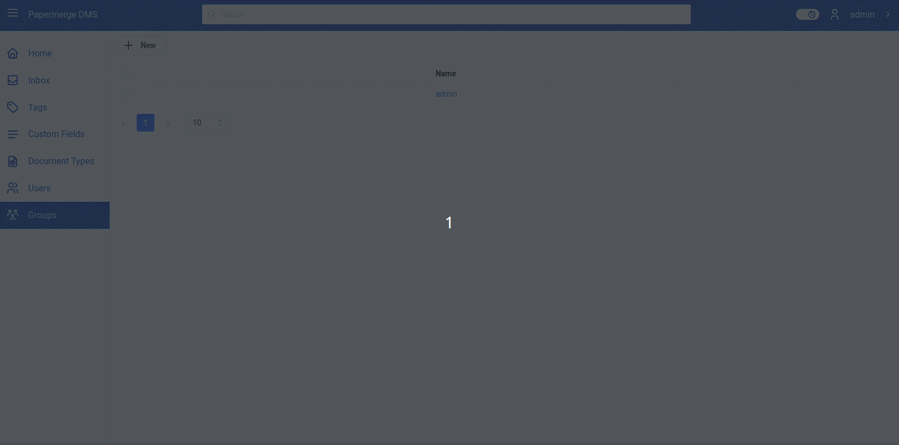

# Updates

After long and fun development, release 3.3 is almost ready to go out.
Version 3.3 will be officially released in mid November 2024.
It will feature custom fields per document type.
Besides view of the custom fields inside document viewer, user
will be able to list ALL documents of specific document type along with
their custom fields (thus user will be able to sort/filter by custom fields).

The plan for subsequent releases is following:

- Demo page will come back in November 2024
- papermerge.com web page will be fully updated in November 2024 as well
- Version 3.4 will be out in December 2024 and it will include documents/folder sharing
  between users and user groups

of course documentation for version 3.3 with setup guides will be updated.
Here is a quick preview of how 3.3 will look like.

In case you are wondering what was happening since April 2024 (when 3.2 was out) until today (October 2024):
I've re-written frontend almost from scratch!

If you are not interested in very technical jargon, you can stop reading now, because what will
follow is intended only for tech nerds. Thank you for reading this blog post so far. Bye.

So, dear nerd, as I said above - I was re-writing whole frontend. To be exact: now papermerge
frontend is Vite + React + TypeScript + Redux Toolkit + Mantine stack application.

Everybody knows what first four entities are.

But what is Mantine?

[Mantine is this](https://mantine.dev/), awesome, fantastic - reactive UI library.

Now, that I have plenty of time - Papermerge development is full speed again. Last time
when it was full time developing it was back in 2020.
